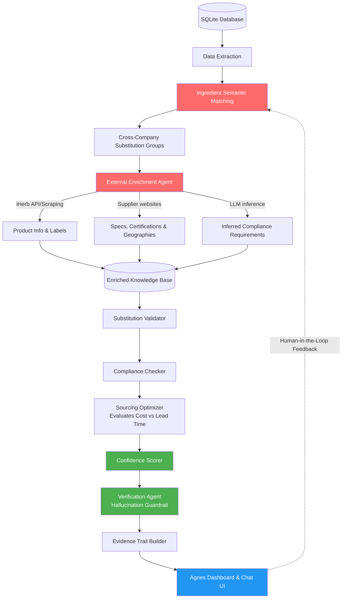

# Final Architecture Recommendation: "Agnes" AI Supply Chain Manager

This document outlines the finalized, production-ready architecture for the Spherecast challenge. It builds upon the initial technical review and incorporates necessary mechanisms to handle uncertainty, trustworthiness, and tradeoff evaluation to guarantee maximum points against the judging criteria.

## 1. System Architecture Diagram

---

## 2. Phase-by-Phase Breakdown

### Phase 1: Smart Data Extraction & Semantic Matching
**Goal:** Ingest the raw relational data and group ingredients that are functionally identical across different companies.
*   **Action:** Parse SKU strings (e.g., `RM-C28-vitamin-d3-cholecalciferol-8956b79c`) to extract the canonical ingredient name (`vitamin-d3-cholecalciferol`).
*   **Action:** Use embedding models (e.g., OpenAI `text-embedding-3-small`) combined with fuzzy matching to cluster functionally equivalent ingredients across the 61 companies into **Substitution Groups**.

### Phase 2: External Enrichment Agent *(The Critical Differentiator)*
**Goal:** Fill the massive gaps in the provided dataset (missing compliance, lead times, certifications).
*   **iHerb Integration:** Use the `iherb` identifiers hidden in the SKUs to scrape or retrieve real-world product pages, ingredient lists, and brand positioning (e.g., "Non-GMO certified").
*   **Supplier Recon:** Automate web searches on the 40 provided suppliers. Extract compliance documents, specification sheets, and corporate locations (which serves as a proxy for Lead Time estimations).
*   **Compliance Inference:** Use an LLM to infer finished-good requirements. If a finished product is labeled "Organic Vitamin D", the system must infer that all sub-components require organic certification.

### Phase 3: Reasoning, Optimization & Trust *(The Core Intelligence)*
**Goal:** Evaluate substitutions, build optimizations, and aggressively prevent hallucinations.
*   **Substitution & Compliance Validation:** Check if moving an ingredient to a new, consolidated supplier breaks the inferred compliance rules of the finished product.
*   **Sourcing Optimizer:** Generate proposals that balance consolidation benefits (volume) against risks (increased lead time from geographically distant suppliers, or single point of failure risk).
*   **Confidence Scorer:** **(Crucial)** Assign a confidence score (0-100%) to every proposed substitution. If external data is sparse, the confidence score drops, and the system flags it for human review rather than blindly proceeding.
*   **Verification Agent:** A secondary, low-temperature LLM prompt acts as a strict guardrail. It checks the final proposal against the raw scraped context to ensure Agnes isn't hallucinating a certification that wasn't actually found.

### Phase 4: Output & Evidence Trail
**Goal:** Present the findings in an explainable, business-centric format.
*   **Evidence Trail Builder:** For every recommendation, surface exact citations. (e.g., *"Recommending consolidation to Supplier X. Evidence: Supplier X website confirms Kosher certification [Link], meeting the requirement inferred from Finished Good Y's label [Link]."*).
*   **User Interface:** A dashboard prioritizing the highest-value, highest-confidence consolidation opportunities, supported by a conversational interface for ad-hoc questioning.

---

## 3. Addressing the Core Judging Criteria

By strictly following this architecture, you systematically check off every requirement the judges are looking for:

| Judging Criteria | How this Architecture Solves It |
| :--- | :--- |
| **Substitution Logic** | Addressed immediately in Phase 1 via semantic grouping of SKUs, moving beyond exact string matches. |
| **Missing External Info** | Phase 2 is entirely dedicated to filling gaps via iHerb and Supplier scraping. |
| **Handling Uncertainty** | Addressed via the **Confidence Scorer** (Phase 3), ensuring the system flags missing data rather than guessing. |
| **Tradeoff Explanations** | The **Sourcing Optimizer** balances consolidation benefits against estimated lead times and compliance risks. |
| **Trust & Hallucination Control** | Solved by the **Verification Agent** acting as an independent checker and the **Evidence Trail Builder** enforcing citations. |
| **Scalability & Improvement** | While not built into the hackathon code to save time, the diagram highlights a **Human-in-the-Loop (HITL) feedback mechanism** where human approvals/rejections improve the semantic matching model over time. (Make sure to mention this in the presentation!). |
