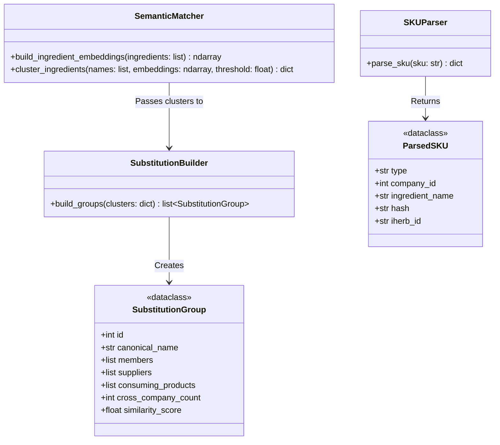
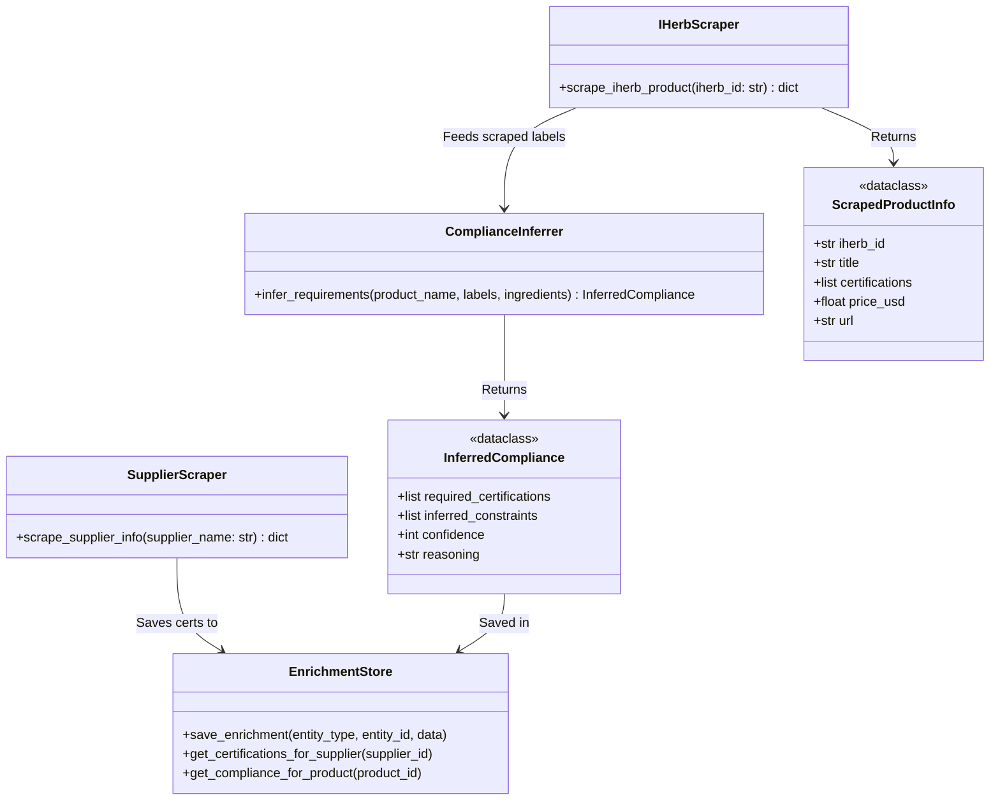
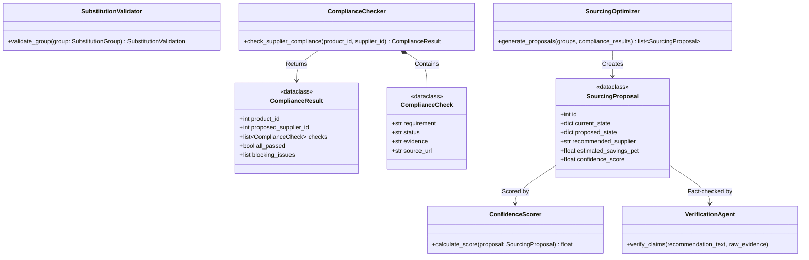
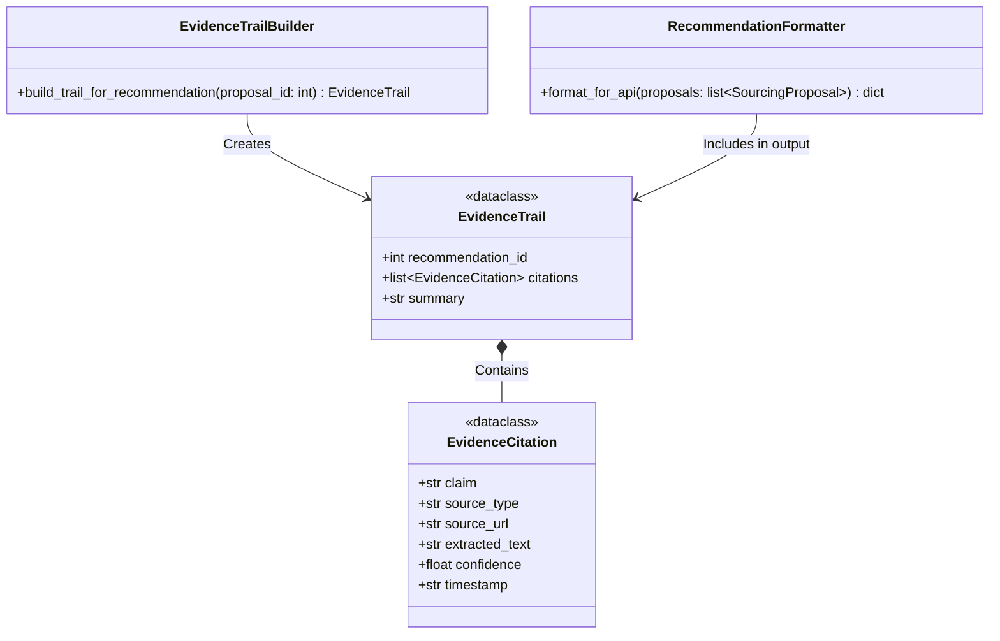

Here is a detailed breakdown of how the code is implemented across the 4 phases. I have created a carousel with **Mermaid Class Diagrams** to represent the core modules, their methods, and the data models (dataclasses) used in each phase.

### Phase 1: Smart Data Extraction & Semantic Matching

This phase focuses on parsing the raw database SKUs and using OpenAI embeddings to group ingredients that are functionally identical into `SubstitutionGroup` models.

<!-- slide -->
### Phase 2: External Data Enrichment

This phase uses web scraping and LLMs to infer the compliance requirements (like Non-GMO or Organic) from external sources, filling in the gaps of the internal database.

<!-- slide -->
### Phase 3: Reasoning, Optimization & Trust

The "Brain" of Agnes. It takes the enriched data, validates substitutions, checks for compliance passes/fails, and creates a consolidated sourcing proposal. The `VerificationAgent` acts as a guardrail against AI hallucination.

<!-- slide -->
### Phase 4: Output & Evidence Trail

The final phase packages the recommendations along with traceable proof. It creates an `EvidenceTrail` mapped to citations to ensure users can verify the source of truth for the AI's logic.

### Summary of How the Code Links Together

1. **Phase 1** pulls raw rows from SQLite and turns them into `SubstitutionGroup` objects.
2. **Phase 2** kicks off background scrapers to populate the `EnrichmentStore` with external facts (like "Supplier X is Kosher").
3. **Phase 3** runs business logic classes (`ComplianceChecker`, `SourcingOptimizer`) on those grouped objects using the fetched facts, outputting a `SourcingProposal`.
4. **Phase 4** loops over the generated `SourcingProposal` models, attaches an `EvidenceTrail` to each, and serves them to the React frontend via FastAPI endpoints.
