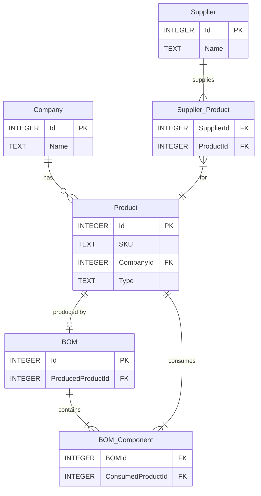
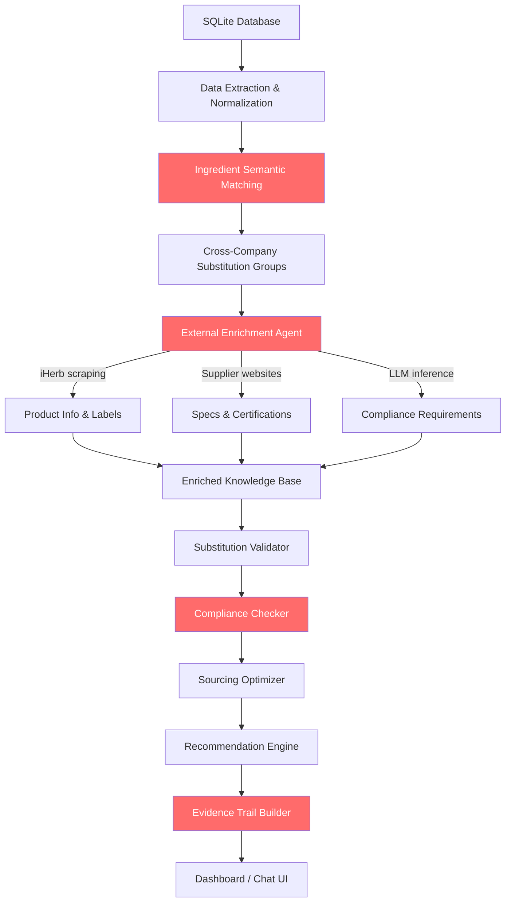

# 🔬 Deep Analysis: Spherecast "Agnes" Hackathon Challenge & Technical Pipeline Review

## 1. Problem Understanding

### What Spherecast Actually Wants
This is **not** a chatbot challenge. It's an **AI-powered decision-support system** for CPG (Consumer Packaged Goods) supply chain sourcing. The core problem:

> CPG companies buy the **same raw ingredient** from multiple suppliers under different names, without visibility into combined demand. This means they **overpay** because they can't consolidate purchases for volume discounts — and they're **afraid to consolidate** because they don't know if a substitute will break compliance (organic, non-GMO, kosher, etc.).

### The Three Pillars the Judges Will Score On

| Pillar | What It Means | Weight |
|--------|--------------|--------|
| **Substitution Detection** | Can your system identify that "Citric Acid Anhydrous" and "E330" are the same thing across different companies/BOMs? | 🔴 Critical |
| **Compliance & Quality Inference** | Can your system figure out if switching to a cheaper supplier still meets the product's requirements (organic, non-GMO, etc.)? This requires **external data** | 🔴 Critical |
| **Explainable Sourcing Proposal** | Can you produce a clear, evidence-backed recommendation with cost savings, risk flags, and tradeoff explanations? | 🔴 Critical |

### What the Judges Explicitly Do NOT Care About
> "**UI polish is not a priority**" — direct quote from the challenge brief.

---

## 2. Database Deep Dive

### Schema (ERD)



### Key Data Stats

| Entity | Count | Notes |
|--------|-------|-------|
| Companies | 61 | Real CPG brands (NOW Foods, Solgar, Optimum Nutrition, etc.) |
| Finished Goods | 149 | Products with BOMs |
| Raw Materials | 876 | Ingredients consumed by BOMs |
| BOMs | 149 | One BOM per finished good |
| BOM Components | 1,528 | Avg ~10 ingredients per product |
| Suppliers | 40 | Real suppliers (ADM, AIDP, Actus Nutrition, etc.) |
| Supplier-Product links | 1,633 | Which suppliers can provide which raw materials |

### Critical Data Observations

> [!IMPORTANT]
> The data has **no prices, no lead times, no compliance/certification info, and no quality specs**. The SKU names ARE the only signal for ingredient identity.

1. **SKU naming convention**: `RM-C{CompanyId}-{ingredient-name}-{hash}` — This means the **same ingredient** at different companies has **different product IDs and different SKUs**. For example:
   - `RM-C28-vitamin-d3-cholecalciferol-8956b79c` (Company 28 / NOW Foods)
   - `RM-C30-vitamin-d3-cholecalciferol-559c9699` (Company 30)
   - `RM-C1-vitamin-d3-cholecalciferol-67efce0f` (Company 1 / 21st Century)

2. **Cross-company substitution is the core challenge**: The ingredient names embedded in SKUs are the same across companies, but they are different database records. Your system must **semantically group them**.

3. **Shared raw materials**: Some raw materials appear in up to 12 BOMs (e.g., `magnesium-stearate` in 12 BOMs from company 30 alone). Across companies, the same logical ingredient appears many more times.

4. **Supplier overlap is minimal**: Most raw materials have only 1 supplier. Maximum observed is 2 suppliers per product. This limits pure "supplier switching" but amplifies the **cross-company consolidation** opportunity.

5. **Missing data that MUST be enriched externally**:
   - ❌ No pricing
   - ❌ No lead times
   - ❌ No certifications (organic, non-GMO, kosher, etc.)
   - ❌ No product descriptions beyond SKU names
   - ❌ No compliance requirements for finished goods

---

## 3. Critical Review of the Proposed Technical Pipeline

### What the Pipeline Proposes

```
SQLite → Cognee (GraphRAG) → FastAPI Bridge → Dify (Agentic LLM Workflow) → User
```

### Verdict: ⚠️ Structurally Sound Architecture, But Missing the Core Challenge Logic

The pipeline is a solid **infrastructure skeleton**, but it's like building a beautiful highway with no cars on it. Here's why:

---

### 🔴 Gap 1: No Substitution Detection Logic

**The single most important capability** the judges want — and the pipeline doesn't address it at all.

The pipeline says "feed data into Cognee and it will cognify." But Cognee is a general-purpose knowledge graph builder. It will create entity relationships, but it **will NOT automatically**:
- Parse SKU names to extract ingredient identifiers
- Recognize that `RM-C28-vitamin-d3-cholecalciferol-8956b79c` and `RM-C1-vitamin-d3-cholecalciferol-67efce0f` are the same ingredient
- Group functionally equivalent ingredients (e.g., "sunflower lecithin" ≈ "soy lecithin" for some use cases)
- Score substitutability confidence

**What you need**: A dedicated **ingredient normalization and semantic matching layer** BEFORE the knowledge graph. This is where embeddings, fuzzy matching, and LLM-based classification shine.

---

### 🔴 Gap 2: No External Data Enrichment Strategy

The challenge brief literally says: *"External enrichment is strongly encouraged and will be necessary for strong results."*

The pipeline has **zero** strategy for:
- Scraping supplier websites for product specs, certifications
- Querying certification databases (USDA Organic, Non-GMO Project, Kosher)
- Looking up iHerb product pages (the SKUs contain `iherb` references!)
- Extracting compliance requirements from product labels/descriptions

**This is table-stakes for winning.** The data has no prices, no compliance info. If you don't enrich, you can't recommend.

---

### 🔴 Gap 3: No Compliance Inference Engine

The pipeline's LLM node just says "answer the query using context." But the hard problem is:
- Given a finished good (e.g., an organic supplement), what compliance requirements does it impose on its ingredients?
- Does a proposed substitute meet those requirements?
- What's the evidence trail?

This requires **structured reasoning**, not just RAG retrieval.

---

### 🟡 Gap 4: Cognee Data Ingestion is Too Naive

The pipeline code does:
```python
doc_text = f"Component: {row[1]}, Supplier: {row[2]}, Specs: {row[3]}"
```

But the actual database has **no `specs` column**. The schema is `(Id, SKU, CompanyId, Type)`. The code references columns that don't exist. More importantly, you need to ingest the **relational structure** (Company → Product → BOM → Components → Suppliers), not just flat text documents.

---

### 🟡 Gap 5: No Optimization/Recommendation Layer

The challenge asks for a **"consolidated sourcing proposal."** This means:
- Calculate potential savings from consolidation
- Rank opportunities by business value
- Consider lead time, supplier risk, volume discounts
- Present a prioritized action list

The pipeline has none of this. It's just Q&A.

---

### 🟡 Gap 6: Feedback Loop is Premature

The `memory/add` endpoint that re-cognifies on every user interaction is both:
- **Computationally expensive** (re-building the entire graph per feedback)
- **Unnecessary for the hackathon demo** — you're not building a production system

---

### 🟢 Gap 7: Dify Orchestration is Fine, But Overcomplicated for a Hackathon

Dify is a good tool for production. For a hackathon where **reasoning quality matters more than infrastructure**, you'd be better off with a simpler Python-native agentic loop (e.g., LangGraph, or even raw OpenAI function calling) that gives you more control over the logic.

---

## 4. Revised Architecture Recommendation

> [!TIP]
> The winning team will be the one that produces the **best reasoning and evidence quality**, not the prettiest infrastructure. Focus your 24-48 hours on the **analysis logic**, not the plumbing.

### Proposed Architecture



### Phase-by-Phase Breakdown

#### Phase 1: Smart Data Extraction (2-3 hours)
Instead of dumping flat text into Cognee, do proper relational extraction:

```python
# Extract ingredient groups across companies
# "vitamin-d3-cholecalciferol" appears in companies 1, 28, 30, etc.
# Group them as ONE logical ingredient with multiple company-specific instances
```

- Parse SKU names to extract canonical ingredient names
- Build a cross-company ingredient similarity matrix using embeddings + fuzzy matching
- Create substitution groups (ingredients that are functionally equivalent)

#### Phase 2: External Enrichment (4-6 hours) — **THIS IS WHERE YOU WIN**
- **iHerb product pages**: SKUs reference iHerb IDs → scrape product descriptions, certifications, ingredient labels
- **Supplier websites**: Look up the 40 suppliers, find product catalogs, certifications
- **LLM-based compliance inference**: Use GPT-4 / Claude to infer what certifications a product likely requires based on its name, brand positioning, and ingredient list
- **Pricing estimates**: Even rough market pricing from web search would be valuable

#### Phase 3: Reasoning Engine (4-6 hours)
- For each substitution group, evaluate:
  - Which ingredients are truly interchangeable?
  - What compliance constraints exist?
  - What would consolidation save?
  - What are the risks?
- Build evidence trails linking each claim to a source

#### Phase 4: Output & Presentation (3-4 hours)
- Dashboard showing top N consolidation opportunities
- Deep dive view with evidence trails
- Simple chat interface for ad-hoc queries (this is where Cognee/RAG adds value)

---

## 5. Bottom Line Assessment

| Aspect | Current Pipeline | Needed for Win |
|--------|-----------------|----------------|
| Infrastructure | ✅ Cognee + FastAPI + Dify is solid | ✅ Fine, but simpler may be better |
| Substitution Detection | ❌ Not addressed | 🔴 Core requirement |
| External Data Enrichment | ❌ Not addressed | 🔴 Essential — judges want to see it |
| Compliance Inference | ❌ Not addressed | 🔴 Core differentiator |
| Evidence Trails | ❌ Not addressed | 🔴 Judging emphasis: "trustworthiness" |
| Sourcing Optimization | ❌ Not addressed | 🟡 Important for business value |
| Hallucination Control | ❌ Not addressed | 🟡 Judging emphasis |
| Data Ingestion Quality | ⚠️ Wrong column references | 🟡 Needs fixing |

> [!CAUTION]
> **The proposed pipeline will NOT win the hackathon in its current form.** It provides infrastructure but completely misses the analytical depth, external enrichment, and reasoning quality that the judges will score on. The pipeline is a nice "how to connect tools" guide but it's about 20% of what's needed. The remaining 80% — the actual intelligence — is not designed yet.

### My Recommendation
Keep Cognee as your knowledge backend if the team is comfortable with it, but **invest 70% of your hackathon time on**:
1. **Ingredient normalization + semantic grouping** (the substitution detection)
2. **External data enrichment** (iHerb scraping, supplier lookup, LLM inference)
3. **Compliance reasoning with evidence trails**

These three things will differentiate you from every other team. The infrastructure is just plumbing.
